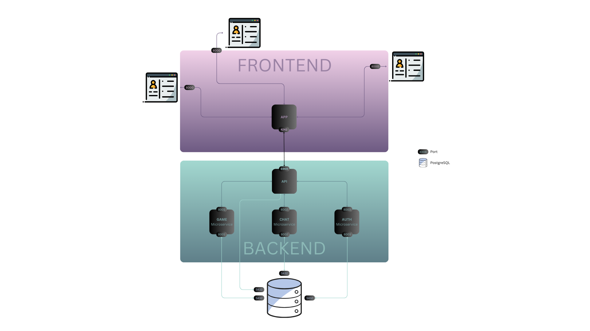

# TEST_ENVIRONMENT
<br></br>
Project Setup:


```
TEST_ENVIRONMENT/
│
├── backend/
│   │ 
│   ├── backend_app/
│   │   │
│   │   ├── migrations/
│   │   │   └── __init__.py
│   │   │
│   │   ├── middleware/
│   │   │   └── cors.py
│   │   │
│   │   ├── __init__.py
│   │   ├── admin.py
│   │   ├── apps.py
│   │   └── modules.py
│   │ 
│   ├── backend/
│   │   ├── __init__.py
│   │   ├── settings.py
│   │   └── urls.py
│   │ 
│   ├── db.sqlite3
│   │ 
│   └── manage.py
│
│
├── frontMockVue/
│   │ 
│   └── frontTest/
│       │
│       ├── public/
│       │   ├── *.html
│       │   └── *.ico
│       │
│       ├── src/
│       │   ├── assets/
│       │   │   └── *.png
│       │   │
│       │   ├── components/
│       │   │   └── MyComponent.vue [main FE file rn]
│       │   │
│       │   ├── App.vue
│       │   └── main.js
│       │ 
│       ├── babel.config.js
│       ├── *.json
│       └── vue.config.js
│
│
├── frontMock/ [OLD]
│   │ 
│   └── frontTest/
│       │
│       ├── public/
│       │   ├── *.png/jpeg
│       │   └── vite.svg
│       │
│       ├── src/
│       │   ├── *.jsx
│       │   └── *.css
│       │ 
│       ├── index.html
│       ├── *.json
│       └── vite.config.js
│
│
├── virtualEnvironment/
│   └── ...
│ 
└── testing_stage.sh
```

<br></br>


<br></br>
